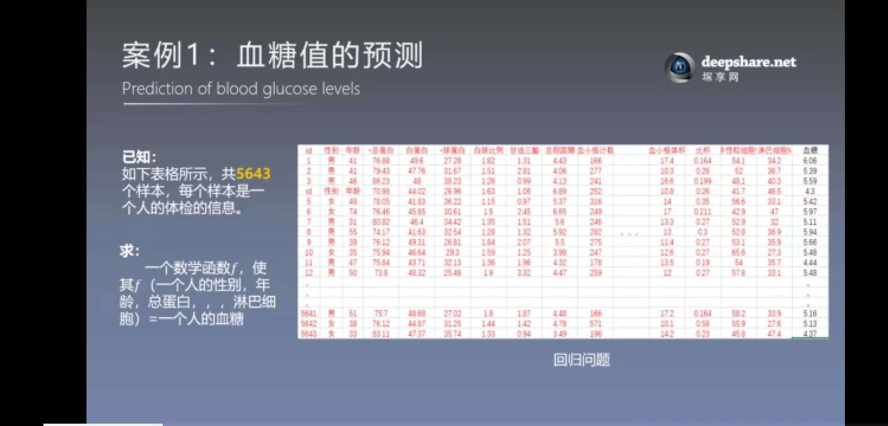
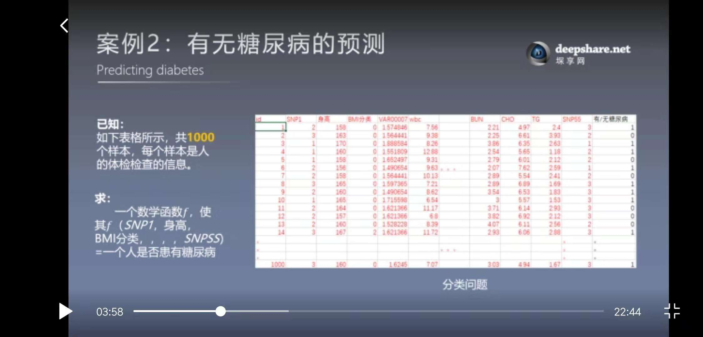

# **一：机器学习绪论部分** #
>## 1.机器学习的四大应用领域及其案例 ##
>>### 1.1数据挖掘 ###
** 发现数据之间的关系 **  
** 案例 **   

>>### 1.2.计算机视觉 ###
** 向人一样看懂世界 **
>>### 1.3.自然语言处理 ###
** 像人一样看懂文字 **
>>### 1.4.机器人决策 ###
** 像人一样具有决策能力 **
>## 2.机器学习理论的分类 ##
>## 3.机器学习训练营介绍 ##
